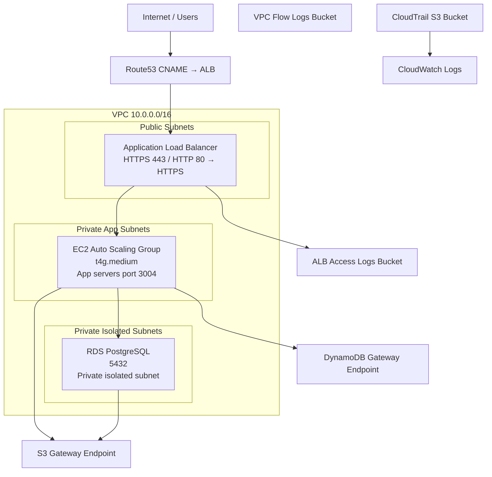

# FlairX Infrastructure - Visual Architecture Diagrams

## High-Level Architecture

```
┌─────────────────────────────────────────────────────────────────────────┐
│                           INTERNET                                       │
│                     (Users, External Services)                           │
└────────────────────────────────────────┬────────────────────────────────┘
                                         │
                                         │ HTTPS/HTTP
                                         │
                    ┌────────────────────▼──────────────────┐
                    │      Route53 (api.flairx.ai)          │
                    │        CNAME to ALB DNS Name          │
                    └────────────────────┬──────────────────┘
                                         │
                                         │
           ┌─────────────────────────────▼──────────────────────────────┐
           │          AWS REGION (us-east-1)                            │
           │                      VPC (10.0.0.0/16)                     │
           │                                                             │
           │  ┌───────────────────────────────────────────────────────┐ │
           │  │          PUBLIC SUBNETS (ALB Tier)                    │ │
           │  │          10.0.{0,1}.0/24 (AZ-1, AZ-2)                │ │
           │  │                                                        │ │
           │  │  ┌────────────────────────────────────────────────┐  │ │
           │  │  │  Application Load Balancer                     │  │ │
           │  │  │  - HTTPS Listener (443)                        │  │ │
           │  │  │  - HTTP Listener (80) → HTTPS redirect         │  │ │
           │  │  │  - Access Logs → S3                            │  │ │
           │  │  │  - Deletion Protection: Enabled                │  │ │
           │  │  └────────────────────┬───────────────────────────┘  │ │
           │  │                       │                               │ │
           │  └───────────────────────┼───────────────────────────────┘ │
           │                          │                                  │
           │  ┌───────────────────────▼───────────────────────────────┐ │
           │  │      PRIVATE APP SUBNETS (EC2 Tier)                   │ │
           │  │      10.0.{2,3}.0/24 (AZ-1, AZ-2)                    │ │
           │  │                                                        │ │
           │  │  ┌─────────────────────────────────────────────────┐ │ │
           │  │  │     Auto Scaling Group (1-4 instances)          │ │ │
           │  │  │                                                  │ │ │
           │  │  │  ┌──────────────┐  ┌──────────────┐            │ │ │
           │  │  │  │   EC2 #1     │  │   EC2 #2     │  ...      │ │ │
           │  │  │  │ t4g.medium   │  │ t4g.medium   │            │ │ │
           │  │  │  │ Amazon Linux │  │ Amazon Linux │            │ │ │
           │  │  │  │ Node.js v20  │  │ Node.js v20  │            │ │ │
           │  │  │  │ PM2          │  │ PM2          │            │ │ │
           │  │  │  │ CW Agent     │  │ CW Agent     │            │ │ │
           │  │  │  │ Port 3004    │  │ Port 3004    │            │ │ │
           │  │  │  └──────────────┘  └──────────────┘            │ │ │
           │  │  │                                                  │ │ │
           │  │  │  Scaling Policies:                              │ │ │
           │  │  │  - CPU > 60% → Scale Out                       │ │ │
           │  │  │  - ALB Request Count → Scale Out               │ │ │
           │  │  │  - Scale-in Cooldown: 300s                     │ │ │
           │  │  └─────────────────────────────────────────────────┘ │ │
           │  │                                                        │ │
           │  └────────────────────────────────────────────────────────┘ │
           │                                                             │
           │  ┌────────────────────────────────────────────────────────┐ │
           │  │    NETWORK INFRASTRUCTURE                              │ │
           │  │                                                        │ │
           │  │  ┌──────────────────┐  ┌──────────────────────────┐  │ │
           │  │  │   NAT Gateway    │  │  VPC Endpoints (Free)   │  │ │
           │  │  │                  │  │  - S3 Gateway           │  │ │
           │  │  │  - 1 per region  │  │  - DynamoDB Gateway     │  │ │
           │  │  │  - Shared AZs    │  │  (For free egress)      │  │ │
           │  │  │  - Elastic IP    │  │                         │  │ │
           │  │  │  - Cost-opt'      │  │                         │  │ │
           │  │  └──────────────────┘  └──────────────────────────┘  │ │
           │  │                                                        │ │
           │  │  VPC Flow Logs → S3 ($0.023/GB, not CloudWatch)      │ │
           │  └────────────────────────────────────────────────────────┘ │
           │                                                             │
           │  ┌───────────────────────────────────────────────────────┐ │
           │  │  ISOLATED DATA SUBNETS (RDS Tier)                    │ │
           │  │  10.0.{4,5}.0/24 (AZ-1, AZ-2)                       │ │
           │  │  (NO INTERNET ROUTES)                                 │ │
           │  │                                                        │ │
           │  │  ┌────────────────────────────────────────────────┐  │ │
           │  │  │  RDS PostgreSQL 16.1                           │  │ │
           │  │  │  - db.t4g.medium (ARM Graviton, cost-opt)     │  │ │
           │  │  │  - 100 GB gp3 storage (free 3000 IOPS)        │  │ │
           │  │  │  - Single-AZ (Multi-AZ ready: 1 CDK change)  │  │ │
           │  │  │  - KMS CMK encryption at rest                │  │ │
           │  │  │  - Performance Insights (free 7-day)         │  │ │
           │  │  │  - 7-day backups + point-in-time recovery    │  │ │
           │  │  │  - Credentials in Secrets Manager            │  │ │
           │  │  │  - 30-day automatic rotation                 │  │ │
           │  │  │  - Error logs → CloudWatch                    │  │ │
           │  │  │  - Port 5432 (EC2 only, no public)           │  │ │
           │  │  └────────────────────────────────────────────────┘  │ │
           │  │                                                        │ │
           │  └───────────────────────────────────────────────────────┘ │
           │                                                             │
           │  ┌───────────────────────────────────────────────────────┐ │
           │  │  SECURITY                                              │ │
           │  │                                                        │ │
           │  │  Security Groups:                                     │ │
           │  │  ├─ ALB SG: HTTPS/HTTP from 0.0.0.0/0 → EC2:3004   │ │
           │  │  ├─ EC2 SG: ALB SG:3004 → RDS:5432 + Internet:443   │ │
           │  │  └─ RDS SG: EC2 SG:5432 only (no public)            │ │
           │  │                                                        │ │
           │  │  IAM Role: EC2 instances                              │ │
           │  │  ├─ SSM Session Manager (no SSH)                    │ │
           │  │  ├─ CloudWatch Agent                                 │ │
           │  │  ├─ Secrets Manager read (flairx-*)                │ │
           │  │  ├─ S3 read (flairx-* buckets)                      │ │
           │  │  └─ KMS decrypt (secrets)                            │ │
           │  │                                                        │ │
           │  │  Other:                                               │ │
           │  │  ├─ IMDSv2 enforced (no IMDSv1)                     │ │
           │  │  ├─ No open SSH ports                                │ │
           │  │  ├─ RDS encrypted at rest (KMS CMK)                │ │
           │  │  └─ Secrets encrypted + rotated (30 days)          │ │
           │  └───────────────────────────────────────────────────────┘ │
           │                                                             │
           │  ┌───────────────────────────────────────────────────────┐ │
           │  │  MONITORING & LOGGING                                 │ │
           │  │                                                        │ │
           │  │  CloudWatch:                                          │ │
           │  │  ├─ /flairx/application (14-day retention)           │ │
           │  │  ├─ /flairx/errors (30-day retention)               │ │
           │  │  ├─ /flairx/audit (90-day retention)                │ │
           │  │  ├─ 8 Alarms with SNS notifications                │ │
           │  │  └─ Dashboard with key metrics                       │ │
           │  │                                                        │ │
           │  │  CloudTrail:                                          │ │
           │  │  ├─ Management events only (free tier)              │ │
           │  │  ├─ Logs to S3 (30-day IT, 90-day expire)         │ │
           │  │  └─ CloudWatch Logs (90-day retention)             │ │
           │  │                                                        │ │
           │  │  VPC Flow Logs:                                       │ │
           │  │  ├─ All network traffic captured                     │ │
           │  │  └─ S3 destination ($0.023/GB, not CloudWatch)     │ │
           │  │                                                        │ │
           │  │  ALB Access Logs:                                     │ │
           │  │  ├─ S3 bucket with IT + 90-day expiration          │ │
           │  │  └─ For compliance & debugging                       │ │
           │  │                                                        │ │
           │  │  Alarms (8 total):                                    │ │
           │  │  ├─ EC2 CPU > 60% (scale awareness)                │ │
           │  │  ├─ EC2 CPU > 80% (CRITICAL)                       │ │
           │  │  ├─ RDS CPU > 75%                                   │ │
           │  │  ├─ ALB 5xx error rate > 1%                        │ │
           │  │  ├─ ALB P99 response time > 2s                     │ │
           │  │  ├─ ALB UnHealthyHostCount > 0                     │ │
           │  │  ├─ RDS storage < 10 GB                            │ │
           │  │  └─ ASG at max capacity                             │ │
           │  └───────────────────────────────────────────────────────┘ │
           │                                                             │
           └─────────────────────────────────────────────────────────────┘
```

---

## Data Flow Diagram

```
┌──────────────────┐
│   Client (User)  │
└────────┬─────────┘
         │
         │ HTTPS/HTTP
         │
    ┌────▼─────┐
    │  Route53  │
    │  (CNAME)  │
    └────┬─────┘
         │
         │ Route to ALB DNS
         │
    ┌────▼──────────────────────┐
    │  Security Group            │
    │  (Allow 443, 80)           │
    └────┬──────────────────────┘
         │
    ┌────▼──────────────────────────────────────┐
    │ Application Load Balancer                 │
    │ - Listener: HTTPS (443)                   │
    │ - Listener: HTTP (80) → HTTPS redirect    │
    │ - Target Group (Port 3004)                │
    │ - Health Check (/health, 30s interval)   │
    └────┬──────────────────────────────────────┘
         │
         │ Forward to healthy targets
         │
    ┌────▼──────────────────────┐
    │  Security Group            │
    │  (Allow 3004 from ALB)     │
    └────┬──────────────────────┘
         │
    ┌────▼──────────────────────────────────────┐
    │ EC2 Instance (t4g.medium)                 │
    │ - Node.js v20 LTS                         │
    │ - PM2 Process Manager                     │
    │ - Application Code (Port 3004)            │
    │ - CloudWatch Agent (Logs)                │
    │ - SSM Session Manager (Access)           │
    └────┬────────────────────┬─────────────────┘
         │                    │
         │ Database           │ Logs
         │ Access             │
         │                    │
    ┌────▼──────────┐     ┌──▼──────────────┐
    │  RDS          │     │ CloudWatch      │
    │  PostgreSQL   │     │ Log Groups      │
    │  (5432)       │     │                │
    │  - Encrypted  │     │ - /flairx/app  │
    │  - Backups    │     │ - /flairx/err  │
    │  - Replic.    │     │ - /flairx/aud  │
    └───────────────┘     └─────────────────┘
         │
    ┌────▼──────────┐
    │  KMS Key      │
    │  (Encryption) │
    └───────────────┘

    Secrets Flow:
    EC2 Instance → IAM Role → Secrets Manager → KMS Decrypt → DB Credentials
```

---

## Traffic Flow Diagram

```
                    ┌─────────────────────┐
                    │   User Traffic      │
                    │  (api.flairx.ai)    │
                    └──────────┬──────────┘
                               │
                               ▼
                    ┌──────────────────────┐
                    │    ALB Security Gr.  │
                    │  Allow: 443, 80      │
                    └──────────┬───────────┘
                               │
                    ┌──────────▼───────────┐
                    │  ALB Listeners       │
                    │  443 HTTPS (primary) │
                    │  80 HTTP→HTTPS       │
                    └──────────┬───────────┘
                               │
                               ▼
                    ┌──────────────────────┐
                    │  Target Group        │
                    │  Health: /health     │
                    │  Port: 3004          │
                    └──────────┬───────────┘
                               │
         ┌─────────────────────┼──────────────────────┐
         │                     │                      │
         ▼                     ▼                      ▼
    ┌────────────┐      ┌────────────┐      ┌────────────┐
    │  EC2 #1    │      │  EC2 #2    │      │  EC2 #n    │
    │ Healthy ✓  │      │ Healthy ✓  │●●●●●●│ Healthy ✓  │
    └────────────┘      └────────────┘      └────────────┘
         │                     │                      │
         │  Database Queries   │                      │
         │                     │                      │
         └──────────┬──────────┴──────────┬───────────┘
                    │                    │
              ┌─────▼────────────────────▼──────┐
              │  RDS PostgreSQL                 │
              │  (Isolated Subnet, No Public IP)│
              └───────────────────────────────────┘
```

---

## Network Topology

```
┌───────────────────────────────────────────────────────────────┐
│ AWS Region (us-east-1)                                         │
│ ┌─────────────────────────────────────────────────────────────┐
│ │ VPC (10.0.0.0/16)                                            │
│ │                                                               │
│ │  ┌────────────────────────────────────────────────────────┐ │
│ │  │ Availability Zone 1 (us-east-1a)                       │ │
│ │  │                                                         │ │
│ │  │  ┌──────────────────────────────────────────────────┐ │ │
│ │  │  │ Public Subnet (10.0.0.0/24)                     │ │ │
│ │  │  │ - ALB                                            │ │ │
│ │  │  │ - NAT Gateway (Elastic IP)                      │ │ │
│ │  │  └──────────────────────────────────────────────────┘ │ │
│ │  │  ┌──────────────────────────────────────────────────┐ │ │
│ │  │  │ Private Subnet App (10.0.2.0/24)               │ │ │
│ │  │  │ - EC2 Instance 1                               │ │ │
│ │  │  │ - Route via NAT GW (or VPC endpoints)         │ │ │
│ │  │  └──────────────────────────────────────────────────┘ │ │
│ │  │  ┌──────────────────────────────────────────────────┐ │ │
│ │  │  │ Private Subnet Data (10.0.4.0/24)             │ │ │
│ │  │  │ - RDS AZ1 (if Multi-AZ)                       │ │ │
│ │  │  │ - No internet route                            │ │ │
│ │  │  └──────────────────────────────────────────────────┘ │ │
│ │  └────────────────────────────────────────────────────────┘ │
│ │                                                               │
│ │  ┌────────────────────────────────────────────────────────┐ │
│ │  │ Availability Zone 2 (us-east-1b)                       │ │
│ │  │                                                         │ │
│ │  │  ┌──────────────────────────────────────────────────┐ │ │
│ │  │  │ Public Subnet (10.0.1.0/24)                     │ │ │
│ │  │  │ - ALB                                            │ │ │
│ │  │  │ - NAT GW (future, for HA)                      │ │ │
│ │  │  └──────────────────────────────────────────────────┘ │ │
│ │  │  ┌──────────────────────────────────────────────────┐ │ │
│ │  │  │ Private Subnet App (10.0.3.0/24)               │ │ │
│ │  │  │ - EC2 Instance 2+                              │ │ │
│ │  │  │ - Route via NAT GW or VPC endpoints           │ │ │
│ │  │  └──────────────────────────────────────────────────┘ │ │
│ │  │  ┌──────────────────────────────────────────────────┐ │ │
│ │  │  │ Private Subnet Data (10.0.5.0/24)             │ │ │
│ │  │  │ - RDS AZ2 (if Multi-AZ)                       │ │ │
│ │  │  │ - No internet route                            │ │ │
│ │  │  └──────────────────────────────────────────────────┘ │ │
│ │  └────────────────────────────────────────────────────────┘ │
│ │                                                               │
│ │  ┌────────────────────────────────────────────────────────┐ │
│ │  │ VPC Endpoints (Regional)                               │ │
│ │  │                                                         │ │
│ │  │ - S3 Gateway Endpoint                                 │ │
│ │  │   Routes to: com.amazonaws.us-east-1.s3              │ │
│ │  │   (Free egress from EC2 & RDS)                       │ │
│ │  │                                                         │
│ │  │ - DynamoDB Gateway Endpoint                          │ │
│ │  │   Routes to: com.amazonaws.us-east-1.dynamodb       │ │
│ │  │   (Future use, free)                                │ │
│ │  └────────────────────────────────────────────────────────┘ │
│ │                                                               │
│ │  ┌────────────────────────────────────────────────────────┐ │
│ │  │ Route Tables                                            │ │
│ │  │                                                         │
│ │  │ Public Route Table:                                    │
│ │  │   0.0.0.0/0 → Internet Gateway                        │ │
│ │  │                                                         │
│ │  │ Private App Route Table:                              │
│ │  │   0.0.0.0/0 → NAT Gateway (AZ1)                      │ │
│ │  │   S3 CIDR   → S3 Gateway Endpoint                    │ │
│ │  │   DynamoDB  → DynamoDB Gateway Endpoint              │ │
│ │  │                                                         │
│ │  │ Isolated Data Route Table:                            │
│ │  │   None (no internet routes)                           │ │
│ │  │   S3/DynamoDB → Gateway Endpoints               │ │
│ │  └────────────────────────────────────────────────────────┘ │
│ └─────────────────────────────────────────────────────────────┘
└───────────────────────────────────────────────────────────────┘
```

---

## Cost Breakdown Diagram

```
Monthly Infrastructure Cost (us-east-1, 1× t4g.medium instance)

┌─────────────────────────────────────────────────────────┐
│ COMPUTE LAYER                                            │
│ EC2 (t4g.medium on-demand)               ~$25/mo       │
│   1 running 24/7 × $0.0336/hr                           │
│   (19% cheaper than t3.medium)                          │
│                                                          │
│ ASG Scaling: Min:1 → Max:4 (scales as needed)          │
│   Additional instances: +$25/mo each                    │
│ ┌────────────────────────────────────────────────────┐ │
│ │ SUBTOTAL: $25/month (1 instance)                  │ │
│ └────────────────────────────────────────────────────┘ │
└─────────────────────────────────────────────────────────┘

┌─────────────────────────────────────────────────────────┐
│ NETWORKING LAYER                                         │
│                                                          │
│ ALB (Application Load Balancer)          ~$16/mo       │
│   $0.0225/hr + data processing (minimal)                │
│                                                          │
│ NAT Gateway (1 for cost-opt)             ~$32/mo       │
│   $0.045/hr + $0.045/GB traffic                        │
│   (VPC endpoints free bypass this for S3)              │
│                                                          │
│ VPC Endpoints (Gateway)                  FREE          │
│   S3 Gateway (free)                                    │
│   DynamoDB Gateway (free)                              │
│                                                          │
│ Route53 (if used)                        <$1/mo        │
│   Hosted zone + queries (minimal)                      │
│ ┌────────────────────────────────────────────────────┐ │
│ │ SUBTOTAL: ~$48/month                              │ │
│ └────────────────────────────────────────────────────┘ │
└─────────────────────────────────────────────────────────┘

┌─────────────────────────────────────────────────────────┐
│ DATABASE LAYER                                           │
│                                                          │
│ RDS PostgreSQL (db.t4g.medium)           ~$50/mo       │
│   $0.0668/hr (10% cheaper than db.t3)                  │
│                                                          │
│ RDS Storage (100 GB gp3)                 ~$10/mo       │
│   $0.10/GB/month (cheaper than gp2)                    │
│   Free baseline: 3000 IOPS                             │
│                                                          │
│ RDS Backup Storage (7-day retention)     ~$5/mo        │
│   First 100GB free tier included                       │
│                                                          │
│ KMS CMK (encryption key)                 ~$1/mo        │
│   $1/month key fee                                     │
│ ┌────────────────────────────────────────────────────┐ │
│ │ SUBTOTAL: ~$66/month                              │ │
│ └────────────────────────────────────────────────────┘ │
└─────────────────────────────────────────────────────────┘

┌─────────────────────────────────────────────────────────┐
│ STORAGE & BACKUPS                                        │
│                                                          │
│ S3 - ALB Access Logs                     ~$0.30/mo      │
│   10 GB/month (minimal ALB traffic)                    │
│   30-day IT + 90-day expiration                        │
│                                                          │
│ S3 - VPC Flow Logs                       ~$0.12/mo     │
│   5 GB/month (all network ops)                         │
│   $0.023/GB (50x cheaper than CloudWatch)             │
│                                                          │
│ S3 - CloudTrail Logs                     <$0.01/mo     │
│   Minimal (management events only)                     │
│ ┌────────────────────────────────────────────────────┐ │
│ │ SUBTOTAL: ~$0.50/month                            │ │
│ └────────────────────────────────────────────────────┘ │
└─────────────────────────────────────────────────────────┘

┌─────────────────────────────────────────────────────────┐
│ MONITORING & LOGGING                                     │
│                                                          │
│ CloudWatch Logs Ingestion                ~$5/mo        │
│   10 GB/month (~14 info + 5 error logs)               │
│   $0.50/GB ingestion (never debug prod!)              │
│                                                          │
│ CloudWatch Alarms                        <$0.10/mo     │
│   8 alarms × $0.10/month = <$1                        │
│                                                          │
│ SNS Notifications                        <$0.10/mo     │
│   Email (free), minimal SMS                           │
│                                                          │
│ CloudTrail                               FREE          │
│   Up to 1 trail free (management events)              │
│ ┌────────────────────────────────────────────────────┐ │
│ │ SUBTOTAL: ~$5/month                               │ │
│ └────────────────────────────────────────────────────┘ │
└─────────────────────────────────────────────────────────┘

┌─────────────────────────────────────────────────────────┐
│ COST SUMMARY                                             │
│                                                          │
│ Compute (EC2, ASG)              ~$25/mo                │
│ Networking (ALB, NAT, endpoints) ~$48/mo               │
│ Database (RDS, storage, key)      ~$66/mo              │
│ Storage & Backups                 ~$0.50/mo            │
│ Monitoring & Logging              ~$5/mo               │
│                                                          │
│ ┏━━━━━━━━━━━━━━━━━━━━━━━━━━━━━━━━━━━━━━━━━━━━━━━━━━━┓ │
│ ┃ TOTAL: ~$130-140/month (with 1 EC2 instance)    ┃ │
│ ┗━━━━━━━━━━━━━━━━━━━━━━━━━━━━━━━━━━━━━━━━━━━━━━━━━━━┛ │
│                                                          │
│ SCALING COSTS:                                           │
│   +$25/mo per additional EC2 instance                  │
│   +$50/mo for Multi-AZ RDS (second instance)          │
│   +$32/mo for second NAT Gateway (HA)                │
│                                                          │
│ OPTIMIZATION OPPORTUNITIES:                             │
│   -10% Compute Savings Plan (after 2-3 weeks)        │
│   -70% Spot instances (test/dev only)                │
│   -40% RDS Reserved Instances (after 3 months stable)│
│ ┏━━━━━━━━━━━━━━━━━━━━━━━━━━━━━━━━━━━━━━━━━━━━━━━━━━━┓ │
│ ┃ OPTIMIZED (Savings Plan): ~$125/month           ┃ │
│ ┗━━━━━━━━━━━━━━━━━━━━━━━━━━━━━━━━━━━━━━━━━━━━━━━━━━━┛ │
└─────────────────────────────────────────────────────────┘
```

---

## Mermaid Architecture Diagram



These diagrams provide a quick visual reference for understanding the architecture at different levels.
