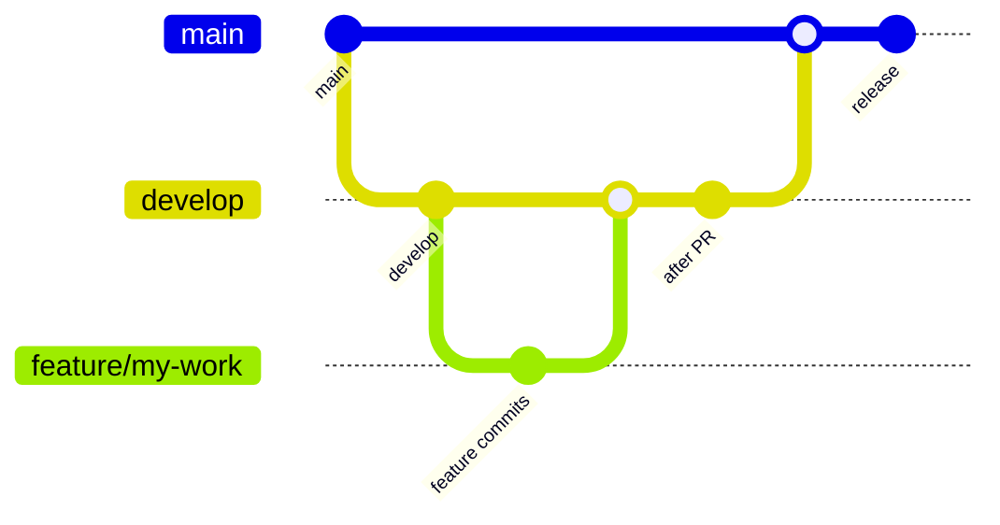

# Contributing & branching workflow

Repository: [github.com/rajivpandeyin/system-design-app](https://github.com/rajivpandeyin/system-design-app)

## Branch flow



| Branch | Purpose | Merges into |
|--------|---------|-------------|
| `feature/*` | Your work (bugfix, feature, chore) | `develop` via PR |
| `develop` | Integration / staging | `main` via PR |
| `main` | Production-ready code | — |

**Do not** open PRs from `feature/*` directly to `main`.

## Step-by-step

### 1. Start from latest `develop`

```bash
git fetch origin
git checkout develop
git pull origin develop
```

### 2. Create a feature branch

```bash
git checkout -b feature/short-description
# examples: feature/url-shortener-ui, fix/login-validation
```

### 3. Commit and push

```bash
git add .
git commit -m "feat: describe your change"
git push -u origin feature/short-description
```

### 4. Open PR → `develop`

On GitHub: **New pull request** → base: `develop` ← compare: `feature/...`

CI runs automatically:

- Unit tests  
- Playwright E2E  
- Production build  
- CI Summary  

Wait for green checks before merging.

### 5. Release: PR `develop` → `main`

When `develop` is stable:

```bash
git checkout develop
git pull origin develop
# Open PR on GitHub: base main ← compare develop
```

Merge after CI passes. Tag releases on `main` if you use versions.

## Local checks (same as CI)

```bash
npm ci
npm run test:unit
npm run test:e2e:install
npm run test:e2e:ci
npm run build
```

## GitHub branch protection (recommended)

**`develop`**

- Require PR before merging  
- Require status checks: `Unit tests`, `Playwright E2E`, `Production build`, `CI Summary`  

**`main`**

- Same required checks  
- Restrict who can push (optional)  
- Only allow merges from `develop` (use rules or review discipline)

## Commit message tips

- `feat:` new feature  
- `fix:` bug fix  
- `docs:` documentation  
- `test:` tests only  
- `chore:` tooling, deps  
