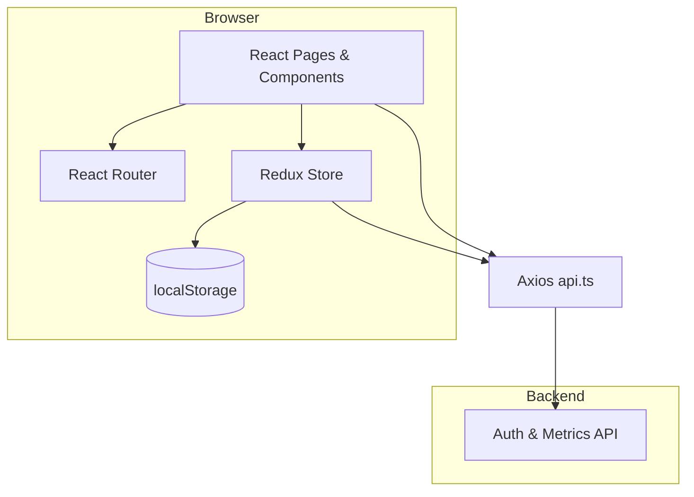
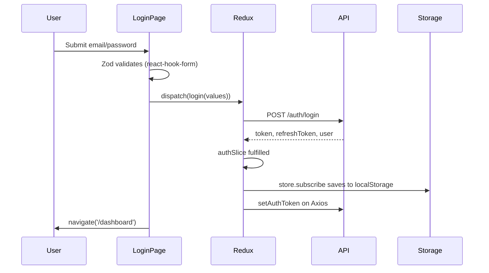
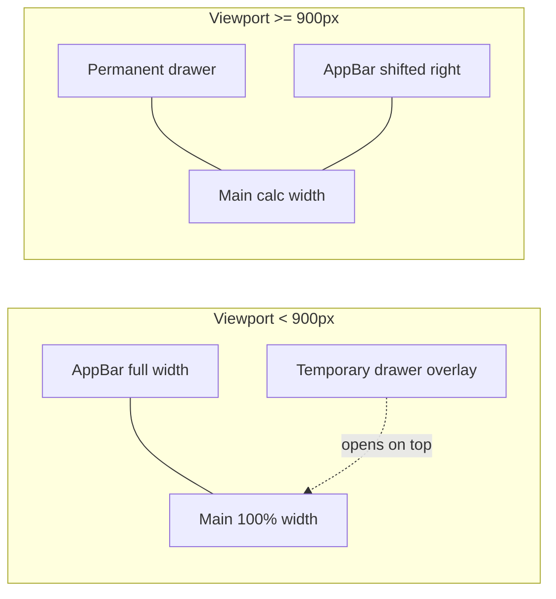

# System Design App — Complete Learning Guide

This document is written for **React beginners** who are preparing for **frontend / React interviews**. It explains **what this app does**, **why each library exists**, **which patterns we use**, and **how the code is organized** — in simple language.

Read this alongside the source code. Open files in the order suggested in each section.

---

## Table of contents

1. [What is this app?](#1-what-is-this-app)
2. [How to run it](#2-how-to-run-it)
3. [Tech stack — every library and why](#3-tech-stack--every-library-and-why)
4. [Project architecture](#4-project-architecture)
5. [App startup — what happens first](#5-app-startup--what-happens-first)
6. [Routing and navigation](#6-routing-and-navigation)
7. [Authentication flow (login, signup, logout)](#7-authentication-flow-login-signup-logout)
8. [Global state with Redux Toolkit](#8-global-state-with-redux-toolkit)
9. [Forms and validation](#9-forms-and-validation)
10. [API layer with Axios](#10-api-layer-with-axios)
11. [Persisting login (localStorage)](#11-persisting-login-localstorage)
12. [Protected routes](#12-protected-routes)
13. [Dashboard layout and responsive design](#13-dashboard-layout-and-responsive-design)
14. [Feature pages explained](#14-feature-pages-explained)
15. [Patterns and best practices used](#15-patterns-and-best-practices-used)
16. [Testing in this project](#16-testing-in-this-project)
17. [Common interview questions (with answers from this app)](#17-common-interview-questions-with-answers-from-this-app)
18. [Glossary](#18-glossary)
19. [Responsive checklist — test every screen size](#19-responsive-checklist--test-every-screen-size)
20. [DashboardLayout walkthrough — line by line](#20-dashboardlayout-walkthrough--line-by-line)

---

## 1. What is this app?

This is a **single-page application (SPA)** built with React. A user can:

| Action | Route | What happens |
|--------|--------|----------------|
| Sign up | `/signup` | Creates account, gets JWT token, goes to dashboard |
| Log in | `/login` | Authenticates, gets token, goes to dashboard |
| View dashboard | `/dashboard` | Overview with metrics cards |
| URL Shortener tool | `/dashboard/url-shortener` | Mock UI for short links + code snippets |
| Google Docs tool | `/dashboard/google-docs` | Mock document workspace |
| Edit profile | `/dashboard/profile` | Update name, email, avatar (with image crop) |
| Log out | App bar button | Clears auth and returns to login |

The backend is a separate Node service (`system-design-auth-service`). The React app talks to it over HTTP.

---

## 2. How to run it

```bash
cd system-design-app
npm install
npm run dev
```

Open `http://localhost:5173` (Vite default port).

Make sure the auth API is running and that `src/lib/api.ts` points to the correct `baseURL` (currently `http://localhost:4005`).

---

## 3. Tech stack — every library and why

### Core

| Library | Role | Why we use it |
|---------|------|----------------|
| **React 18** | UI library | Components, state, effects — industry standard for SPAs |
| **TypeScript** | Static types | Catches mistakes early; great for interviews and teams |
| **Vite** | Build tool | Very fast dev server and production builds vs older tools |

### UI

| Library | Role | Why we use it |
|---------|------|----------------|
| **Material UI (MUI)** | Pre-built components | Buttons, forms, layout, drawer, dialogs — consistent design without writing CSS from scratch |
| **@emotion/react** | CSS-in-JS (MUI dependency) | MUI styles components internally |
| **@mui/icons-material** | Icons | Menu, home, logout, etc. |

**Interview tip:** MUI uses a **design system** (theme, spacing, breakpoints). We customize theme in `src/theme.ts`.

### Routing

| Library | Role | Why we use it |
|---------|------|----------------|
| **react-router-dom v6** | Client-side routing | Change URL without full page reload; nested routes for dashboard |

### State management

| Library | Role | Why we use it |
|---------|------|----------------|
| **Redux Toolkit (RTK)** | Global state | Auth (token, user) is needed in many places — login page, layout, API headers |
| **react-redux** | Connect React to Redux | `useSelector`, `useDispatch` hooks |

**Why not only `useState`?**  
Auth state must survive page refresh, sync to Axios headers, and be read in layout + protected routes. Centralizing in Redux avoids **prop drilling** (passing props through many layers).

### Forms

| Library | Role | Why we use it |
|---------|------|----------------|
| **react-hook-form** | Form state & submission | Less re-renders than controlling every input manually |
| **zod** | Schema validation | One place for rules + TypeScript types |
| **@hookform/resolvers/zod** | Connect Zod to react-hook-form | Automatic error messages on fields |

### HTTP

| Library | Role | Why we use it |
|---------|------|----------------|
| **axios** | HTTP client | Interceptors, defaults (base URL, Authorization header), simpler than raw `fetch` for APIs |

### Profile avatar

| Library | Role | Why we use it |
|---------|------|----------------|
| **react-easy-crop** | Image crop UI | User selects avatar, crops in a dialog before upload |

### Testing (dev)

| Library | Role |
|---------|------|
| **Jest** + **Testing Library** | Unit tests (components, Redux) |
| **Playwright** | End-to-end browser tests |

---

## 4. Project architecture

We use a **feature-based folder structure**. Related code lives together instead of splitting only by type (`all components here, all hooks there`).

```
system-design-app/
├── src/
│   ├── main.tsx              # App entry — providers wrap everything
│   ├── App.tsx               # Route definitions
│   ├── theme.ts              # MUI theme + breakpoints
│   ├── core/                 # Cross-cutting app logic
│   │   ├── ProtectedRoute.tsx
│   │   └── storage.ts        # localStorage helpers
│   ├── features/
│   │   └── auth/             # Everything about authentication
│   │       ├── authSlice.ts  # Redux state + async thunks
│   │       ├── authApi.ts    # API calls
│   │       ├── authSchemas.ts# Zod validation
│   │       └── authTypes.ts  # TypeScript interfaces
│   ├── store/
│   │   ├── store.ts          # Redux store + persistence subscription
│   │   └── hooks.ts          # Typed useDispatch / useSelector
│   ├── lib/
│   │   └── api.ts            # Shared Axios instance
│   ├── components/ui/      # Reusable presentational UI
│   │   └── AuthCard.tsx
│   └── pages/                # Route-level screens
│       ├── LoginPage.tsx
│       ├── SignupPage.tsx
│       ├── DashboardLayout.tsx
│       ├── DashboardPage.tsx
│       ├── UrlShortenerPage.tsx
│       ├── GoogleDocsPage.tsx
│       └── ProfilePage.tsx
```

### Architecture diagram (high level)



### Patterns at a glance

| Pattern | Where | Purpose |
|---------|--------|---------|
| **Feature folder** | `features/auth/` | Group slice, API, schemas, types |
| **Container / page** | `pages/*` | Wire hooks, dispatch, routing |
| **Presentational UI** | `components/ui/AuthCard` | Reusable layout, no business logic |
| **Async thunk** | `authSlice.ts` | Side effects (API) in Redux |
| **Guard route** | `ProtectedRoute.tsx` | Block unauthenticated access |
| **Singleton API client** | `lib/api.ts` | One Axios instance, shared headers |
| **Nested routes** | `App.tsx` | Dashboard shell + child pages |

---

## 5. App startup — what happens first

File: `src/main.tsx`

Order of wrappers (outside → inside):

1. **`React.StrictMode`** — Dev-only checks for unsafe patterns (double-invokes effects in dev).
2. **`Provider` (react-redux)** — Makes Redux store available to all components.
3. **`ThemeProvider` (MUI)** — Applies theme from `src/theme.ts`.
4. **`CssBaseline`** — Normalizes CSS across browsers.
5. **`BrowserRouter`** — Enables routing with URLs like `/login`.
6. **`App`** — Defines routes.

```tsx
// Simplified mental model
<Provider store={store}>
  <ThemeProvider theme={appTheme}>
    <CssBaseline />
    <BrowserRouter>
      <App />
    </BrowserRouter>
  </ThemeProvider>
</Provider>
```

**Why this order?**  
Redux and theme must wrap components that use them. Router must wrap anything using `useNavigate` or `<Routes>`.

---

## 6. Routing and navigation

File: `src/App.tsx`

```tsx
<Routes>
  <Route path="/login" element={<LoginPage />} />
  <Route path="/signup" element={<SignupPage />} />
  <Route path="/dashboard/*" element={<ProtectedRoute><DashboardLayout /></ProtectedRoute>}>
    <Route index element={<DashboardPage />} />
    <Route path="url-shortener" element={<UrlShortenerPage />} />
    ...
  </Route>
  <Route path="*" element={<Navigate to="/login" />} />
</Routes>
```

### Concepts

- **`Routes` / `Route`** — Map URL paths to components.
- **Nested routes** — `/dashboard/*` renders `DashboardLayout`, which has `<Outlet />` for child pages. URL `/dashboard/url-shortener` shows layout + UrlShortenerPage.
- **`Navigate`** — Programmatic redirect (e.g. unknown URL → login).
- **`useNavigate()`** — Hook to redirect after login/logout.

**Interview tip:** In React Router v6, nested routes use relative paths (`url-shortener` not `/dashboard/url-shortener` inside the parent, but full path is still `/dashboard/url-shortener`).

---

## 7. Authentication flow (login, signup, logout)

### Login sequence



### Files involved

| Step | File |
|------|------|
| Form UI | `pages/LoginPage.tsx` |
| Validation rules | `features/auth/authSchemas.ts` |
| Dispatch action | `features/auth/authSlice.ts` → `login` thunk |
| HTTP call | `features/auth/authApi.ts` → `loginRequest` |
| Update state | `authSlice` extraReducers on `login.fulfilled` |

### Signup

Same pattern as login, using `signup` thunk and `signupSchema`.

### Logout

`DashboardLayout` dispatches `logout()` reducer → clears token/user → `store.subscribe` clears storage and Axios header → `navigate('/login')`.

There is also `doLogout` async thunk for server-side logout with refresh token (available in slice; layout uses simple `logout` reducer).

---

## 8. Global state with Redux Toolkit

### What is in auth state?

File: `features/auth/authTypes.ts`

```ts
{
  token: string | null;
  refreshToken: string | null;
  user: { name, email } | null;
  status: 'idle' | 'loading' | 'succeeded' | 'failed';
  error: string | null;
}
```

### Slice + thunks

File: `features/auth/authSlice.ts`

- **`createSlice`** — Defines `logout`, `setCredentials` reducers and `extraReducers` for async thunk lifecycle.
- **`createAsyncThunk`** — `login`, `signup`, `refreshAuth`, `doLogout` handle API calls and loading/error state.

**Thunk lifecycle (interview favorite):**

| Phase | What happens in UI |
|-------|---------------------|
| `pending` | `status = 'loading'`, show spinner on button |
| `fulfilled` | Save token & user, redirect |
| `rejected` | `status = 'failed'`, show `error` in Alert |

### Typed hooks

File: `store/hooks.ts`

```ts
export const useAppDispatch = () => useDispatch<AppDispatch>();
export const useAppSelector: TypedUseSelectorHook<RootState> = useSelector;
```

**Best practice:** Always use typed hooks so selectors know the shape of `state.auth`.

### Store setup + hydration

File: `store/store.ts`

1. Read saved auth from `localStorage` via `getAuthFromStorage()`.
2. **`preloadedState`** — Initialize Redux with saved token so refresh keeps user logged in.
3. **`store.subscribe()`** — On every state change, save auth to localStorage and call `setAuthToken()`.

This is a simple form of **state persistence** without Redux Persist library.

---

## 9. Forms and validation

### Zod schemas

File: `features/auth/authSchemas.ts`

```ts
export const loginSchema = z.object({
  email: z.string().email('Enter a valid email'),
  password: z.string().min(6, 'Password must contain at least 6 characters'),
});
export type LoginFormValues = z.infer<typeof loginSchema>;
```

**Why Zod?**

- Validation rules live in one file.
- `z.infer<typeof schema>` gives TypeScript types — no duplicate interfaces.

### react-hook-form on LoginPage

```tsx
const { register, handleSubmit, formState } = useForm<LoginFormValues>({
  resolver: zodResolver(loginSchema),
  defaultValues: { email: '', password: '' },
});
```

- **`register('email')`** — Connects input to form state.
- **`handleSubmit(onSubmit)`** — Runs validation first; only calls `onSubmit` if valid.
- **`formState.errors`** — Shown in `helperText` on TextField.

**Best practice:** Validate on client for fast feedback; server still validates for security.

---

## 10. API layer with Axios

File: `src/lib/api.ts`

```ts
export const api = axios.create({
  baseURL: 'http://localhost:4005',
  headers: { 'Content-Type': 'application/json' },
  timeout: 10000,
});
```

### `setAuthToken(token)`

Sets `Authorization: Bearer <token>` on all future requests. Called:

- After login/signup (via store subscription)
- On app load if token exists in storage

### Feature API module

File: `features/auth/authApi.ts`

Thin functions: `loginRequest`, `signupRequest`, etc.  
**Why separate from slice?** Easier to test and swap (mock API in tests).

Profile page uses `api.get('/auth/me')` and `api.put('/auth/me', payload)` directly — acceptable for a single page; larger apps might add `features/profile/profileApi.ts`.

---

## 11. Persisting login (localStorage)

File: `src/core/storage.ts`

- Key: `system_design_app_auth_v1`
- Stores: `{ token, refreshToken, user }`
- Version in key name allows migration if shape changes later

**Security note for interviews:**  
`localStorage` is vulnerable to XSS. For high-security apps, teams often use **httpOnly cookies** instead. For learning apps and many SPAs, Bearer token in memory + localStorage is common.

---

## 12. Protected routes

File: `src/core/ProtectedRoute.tsx`

```tsx
export function ProtectedRoute({ children }: ProtectedRouteProps) {
  const token = useAppSelector((state) => state.auth.token);
  return token ? children : <Navigate to="/login" replace />;
}
```

**Pattern:** Route guard — if no token, redirect before rendering dashboard.

**Interview extension:** You could also check token expiry, call `refreshAuth` thunk, or show a loading skeleton while hydrating.

---

## 13. Dashboard layout and responsive design

File: `src/pages/DashboardLayout.tsx`

### Layout structure

- **AppBar** (top) — Title, profile avatar, logout
- **Drawer** (side) — Navigation links
- **Main** — `<Outlet />` renders current child page

### Responsive behavior (what we implemented)

| Screen size | Behavior |
|-------------|----------|
| **Mobile** (`< 900px`, `md` breakpoint) | Temporary drawer overlays content; hamburger opens/closes it; selecting a link closes drawer |
| **Desktop** (`≥ 900px`) | Permanent drawer; can collapse to icon-only width |
| **AppBar** | Shorter title on mobile; "Logout" text hidden on very small screens (icon remains) |
| **Main content** | Padding `16px` mobile, `24px` tablet+; `minWidth: 0` prevents horizontal overflow |

### MUI tools used

- **`useMediaQuery(theme.breakpoints.down('md'))`** — Detect mobile vs desktop
- **`Drawer variant="temporary"`** — Mobile overlay
- **`Drawer variant="permanent"`** — Desktop sidebar
- **Responsive `sx` prop** — e.g. `p: { xs: 2, sm: 3 }`, `fontSize: { xs: '1rem', sm: '1.25rem' }`

### Auth pages

`AuthCard` wraps login/signup in a full-viewport centered card with horizontal padding on small screens.

### Tool pages

- **Scrollable tabs** on narrow screens
- **Code blocks** (`<pre>`) use `overflow: auto` so long lines scroll instead of breaking layout
- **Form rows** stack vertically on `xs`, row on `sm+`

Theme breakpoints live in `src/theme.ts` (MUI defaults: sm 600, md 900, lg 1200).

For a **hands-on testing checklist**, see [Section 19](#19-responsive-checklist--test-every-screen-size).  
For a **full code walkthrough** of this file, see [Section 20](#20-dashboardlayout-walkthrough--line-by-line).

---

## 14. Feature pages explained

### DashboardPage (`/dashboard`)

- Reads `user` from Redux for greeting (`useMemo` avoids recalculating every render).
- Fetches `/metrics` in `useEffect` with cleanup flag `mounted` — **prevents setState on unmounted component**.
- **MetricCard** — Small presentational component for stats.
- Grid uses MUI `Grid` with `xs={12} sm={6} md={3}` for responsive columns.

### UrlShortenerPage

- **Local state** (`useState`) for form fields — no need for Redux; data is page-specific.
- **`useMemo`** regenerates code snippet when language/URL/alias change.
- Tabs split "Functionality" vs "Documentation" — pattern for complex UIs.

### GoogleDocsPage

- Document list + options panel in responsive row/column layout.
- Preview panel always visible below — good for demo / system-design discussion.

### ProfilePage

- Loads user from `GET /auth/me`.
- Avatar: file input → FileReader → crop dialog (`react-easy-crop`) → canvas export → base64 in `PUT /auth/me`.
- **`useCallback`** on crop complete handler — stable reference for child component.

**Why canvas for crop?**  
`getCroppedImg` draws the selected region to canvas and exports PNG data URL for upload.

---

## 15. Patterns and best practices used

### ✅ Do's demonstrated in this codebase

1. **Single Axios instance** — Consistent base URL and auth header.
2. **Feature folders** — Auth logic colocated.
3. **Typed Redux hooks** — Safer selectors and dispatch.
4. **Schema-driven forms** — Zod + react-hook-form.
5. **Route-level code splitting ready** — Pages in separate files (could add `React.lazy` later).
6. **Effect cleanup** — `mounted` flag in async effects.
7. **Separation of concerns** — UI vs API vs state vs validation.
8. **Responsive layout** — Mobile-first drawer, breakpoint-based `sx`.
9. **Accessible touches** — `aria-label` on icon buttons, `noValidate` on forms (custom validation).

### 🔄 Things you could improve (good interview talking points)

| Topic | Current | Improvement |
|-------|---------|-------------|
| API errors | Basic message string | Normalized error slice, toast notifications |
| Auth logout | Client-only `logout()` in layout | Call `doLogout` thunk to invalidate refresh token on server |
| Profile API | Direct `api` calls in page | `features/profile` module + RTK Query |
| Code splitting | All routes static import | `lazy()` + `Suspense` per route |
| Token refresh | Thunk exists, not wired | Axios interceptor on 401 → `refreshAuth` |
| `(user as any).avatar` | Type assertion | Extend `user` type in `authTypes.ts` |

---

## 16. Testing in this project

| Command | What it runs |
|---------|----------------|
| `npm run test:unit` | Jest + Testing Library |
| `npm run test:e2e` | Playwright (needs dev server) |

Examples:

- `features/auth/authSlice.test.ts` — Reducer/thunk behavior
- `pages/LoginPage.test.tsx` — Renders form fields

**Interview tip:** Unit test business logic (slice, utils); E2E test critical user journeys (login page loads).

---

## 17. Common interview questions (with answers from this app)

### Q: What is the virtual DOM?

React builds a lightweight tree of UI. When state changes, React diffs the new tree vs old and updates only what changed in the real DOM.

### Q: Controlled vs uncontrolled components?

Login fields use **react-hook-form** which registers inputs — effectively controlled for validation. File input for avatar is **uncontrolled** (read via `files[0]`).

### Q: Why Redux here?

Auth is **global** and must sync to Axios + localStorage + multiple routes. Local `useState` in LoginPage would require passing token up or context.

### Q: What is `useEffect` dependency array?

`useEffect(() => { ... }, [])` runs once on mount (fetch metrics). Missing deps can cause stale closures — linters warn about this.

### Q: What is `useMemo`?

`useMemo(() => greeting, [user])` — Recompute only when `user` changes. Used for expensive derived values or referential stability.

### Q: How do you secure a React app?

- HTTPS in production
- Validate on server
- Don't store secrets in frontend
- XSS hygiene (sanitize HTML if using `dangerouslySetInnerHTML`)
- Prefer httpOnly cookies for tokens in high-security apps
- This app: Bearer token + ProtectedRoute + server validation

### Q: Explain async thunk flow.

`dispatch(login(values))` → pending → API → fulfilled/rejected → slice updates → component re-renders from `useSelector`.

---

## 18. Glossary

| Term | Meaning |
|------|---------|
| **SPA** | Single Page Application — one HTML page, JS swaps views |
| **Component** | Reusable UI piece (function returning JSX) |
| **Props** | Inputs to a component |
| **State** | Data that changes over time inside a component or store |
| **Hook** | Function starting with `use` (useState, useEffect, …) |
| **JSX** | HTML-like syntax in JavaScript |
| **Thunk** | Async action in Redux |
| **Slice** | One piece of Redux state + reducers |
| **JWT** | JSON Web Token — string proving authentication |
| **Bearer token** | `Authorization: Bearer <token>` header |
| **Breakpoint** | Screen width where layout changes (mobile/tablet/desktop) |

---

## 19. Responsive checklist — test every screen size

Use this when you change layout or CSS. Open Chrome DevTools → **Toggle device toolbar** (Ctrl+Shift+M / Cmd+Shift+M) and test the widths below.

### Breakpoints in this app (MUI)

| Name | Min width | Typical device |
|------|-----------|----------------|
| `xs` | 0px | Phone portrait |
| `sm` | 600px | Phone landscape / small tablet |
| `md` | 900px | Tablet / small laptop — **sidebar switches here** |
| `lg` | 1200px | Desktop |
| `xl` | 1536px | Large desktop |

### Global checklist

- [ ] `index.html` has `<meta name="viewport" content="width=device-width, initial-scale=1.0" />`
- [ ] No horizontal scrollbar on any page at 320px width (iPhone SE)
- [ ] Text is readable without zooming (body text roughly 14px+)
- [ ] Tap targets (buttons, nav items) are easy to hit on touch (~44px min height is a good goal)
- [ ] Long code snippets scroll inside their box (`overflow: auto`), not the whole page

### Login / Signup (`AuthCard`)

| Width to test | What to verify |
|---------------|----------------|
| 320px | Card has side padding; form fields are full width; no content cut off |
| 600px+ | Card stays centered, max width 420px |
| Rotate phone | Layout still centered, keyboard does not break layout permanently |

- [ ] Card does not touch screen edges on mobile (`px: { xs: 2, sm: 3 }`)
- [ ] Submit button is full width of the form stack
- [ ] Error `Alert` wraps text instead of overflowing

### Dashboard shell (`DashboardLayout`)

| Width to test | What to verify |
|---------------|----------------|
| &lt; 900px (mobile) | Sidebar hidden by default; hamburger opens **overlay** drawer |
| ≥ 900px (desktop) | Sidebar always visible; hamburger **collapses** to icons-only |
| 899px → 900px | Switching across `md` feels correct (no double drawer, no gap) |

- [ ] **Mobile:** Main content uses full width (`width: 100%`)
- [ ] **Mobile:** Tapping a nav link **closes** the drawer
- [ ] **Mobile:** Tapping backdrop / swipe closes drawer (`onClose`)
- [ ] **Desktop:** Collapsed drawer shows icons with `title` tooltip on hover
- [ ] **Desktop:** AppBar width matches content area (`calc(100% - drawerWidth)`)
- [ ] AppBar title shows only page name on `xs`, full "Admin Panel — …" on `sm+`
- [ ] User name hidden on small screens; avatar still visible
- [ ] Logout: icon only on `xs`, "Logout" text on `sm+`
- [ ] Logout dialog buttons stack full width on mobile (`fullWidth={isMobile}`)
- [ ] `<Toolbar />` spacer under AppBar so content is not hidden behind fixed header

### Dashboard home (`DashboardPage`)

- [ ] Metric cards stack 1 per row on `xs` (`xs={12}`)
- [ ] Two cards per row on `sm` (`sm={6}`)
- [ ] Heading scales down on mobile (`fontSize` in `sx`)

### URL Shortener & Google Docs

- [ ] Tabs scroll horizontally on narrow screens (`variant="scrollable"`)
- [ ] Form row: URL + Alias + Language + Create stack on `xs`, row on `sm+`
- [ ] Create button full width on mobile
- [ ] `<pre>` code blocks scroll horizontally for long lines

### Profile

- [ ] Avatar and fields fit within card on 320px
- [ ] Crop dialog: crop area height smaller on phone (`height: { xs: 280, sm: 360, md: 400 }`)
- [ ] Zoom slider usable on touch

### Quick DevTools recipe

1. Run `npm run dev`
2. Log in → go to `/dashboard`
3. Set width to **375** (iPhone) → run dashboard checklist
4. Set width to **1024** (laptop) → run desktop checklist
5. Repeat on `/dashboard/url-shortener` and `/login`

### Interview one-liner

> "We use MUI breakpoints and `useMediaQuery` for adaptive layout: temporary drawer on mobile, permanent collapsible sidebar on desktop, responsive `sx` for spacing and typography, and `minWidth: 0` on flex children to prevent overflow."

---

## 20. DashboardLayout walkthrough — line by line

Open `src/pages/DashboardLayout.tsx` in your editor and follow this section top to bottom. Line numbers refer to the current file.

### Block A — Imports (lines 1–31)

```tsx
import { useState } from 'react';
import { Link as RouterLink, Outlet, useLocation, useNavigate } from 'react-router-dom';
```

| Line / import | Why it exists |
|---------------|----------------|
| `useState` | Local UI state: mobile drawer open, desktop collapsed, logout dialog |
| `RouterLink` | MUI `ListItemButton` needs a router-aware link (`component={RouterLink}`) |
| `Outlet` | Placeholder where child routes render (`DashboardPage`, etc.) |
| `useLocation` | Read current URL to highlight active nav item |
| `useNavigate` | Programmatic navigation after profile click or logout |
| `useAppDispatch` / `useAppSelector` | Typed Redux hooks for logout and user display |
| `logout` | Redux action that clears token and user |
| MUI components | Pre-built layout primitives (AppBar, Drawer, Dialog, …) |
| `useMediaQuery` + `useTheme` | **Responsive core:** detect screen size vs theme breakpoints |

Icons are separate imports to keep bundle tree-shakeable (only icons you import are bundled).

---

### Block B — Constants (lines 33–40)

```tsx
const drawerWidthOpen = 280;
const drawerWidthClosed = 72;
const navItems = [ ... ];
```

- **280px** — Wide enough for labels ("URL Shortener").
- **72px** — Icon-only rail on collapsed desktop sidebar.
- **`navItems` outside the component** — Array does not need to be recreated every render; paths are stable.

Each item has `path` matching a child route in `App.tsx`.

---

### Block C — Hooks and derived state (lines 42–55)

```tsx
const isMobile = useMediaQuery(theme.breakpoints.down('md'));
```

**This is the main responsive switch.**

- `down('md')` means: viewport **below 900px** → `isMobile === true`.
- Re-runs when window is resized (MUI subscribes to media queries).

```tsx
const [mobileOpen, setMobileOpen] = useState(false);
const [desktopOpen, setDesktopOpen] = useState(true);
```

Two separate booleans because mobile and desktop drawers behave differently:

| State | Mobile | Desktop |
|-------|--------|---------|
| `mobileOpen` | Overlay drawer visible | Ignored |
| `desktopOpen` | Ignored | Expanded vs icon-only |

```tsx
const sidebarExpanded = isMobile ? true : desktopOpen;
const drawerWidth = sidebarExpanded ? drawerWidthOpen : drawerWidthClosed;
```

On mobile, the temporary drawer is always **full labels** when open. On desktop, width depends on collapse.

```tsx
const title = navItems.find((item) => item.path === location.pathname)?.label || 'Dashboard';
```

Derives AppBar title from current path — no extra state needed.

---

### Block D — Event handlers (lines 57–79)

```tsx
const handleDrawerToggle = () => {
  if (isMobile) setMobileOpen((prev) => !prev);
  else setDesktopOpen((prev) => !prev);
};
```

One hamburger button, two behaviors — common responsive pattern.

```tsx
const closeMobileDrawer = () => {
  if (isMobile) setMobileOpen(false);
};
```

Called when user picks a nav link so they see the new page without the menu covering it.

```tsx
const handleConfirmLogout = () => {
  setLogoutDialogOpen(false);
  dispatch(logout());
  navigate('/login');
};
```

Order matters: close dialog → clear Redux (and localStorage via store subscription) → redirect.

---

### Block E — `drawerContent` (lines 81–117)

Reusable JSX injected into **both** drawers (mobile temporary + desktop permanent).

```tsx
component={RouterLink}
to={item.path}
selected={location.pathname === item.path}
onClick={closeMobileDrawer}
```

- **`RouterLink`** — Client-side navigation, no full page reload.
- **`selected`** — MUI highlights active route.
- **`onClick={closeMobileDrawer}`** — Mobile UX: auto-close menu.

```tsx
title={!sidebarExpanded ? item.label : undefined}
```

When desktop sidebar is collapsed, hover shows native tooltip with label.

Responsive `sx` on list items switches between full-width rows and centered icon buttons.

---

### Block F — Root layout & AppBar (lines 119–173)

```tsx
<Box sx={{ display: 'flex', minHeight: '100vh' }}>
```

Classic **flex row**: sidebar + main. `minHeight: '100vh'` fills the screen.

```tsx
<AppBar position="fixed" sx={{
  width: { md: `calc(100% - ${drawerWidth}px)` },
  ml: { md: `${drawerWidth}px` },
  ...
}}>
```

On **desktop**, the AppBar does not sit on top of the drawer — it starts where the drawer ends. On **mobile**, AppBar is full width because the drawer overlays instead of pushing layout.

`zIndex: drawer + 1` keeps the bar above the drawer paper.

```tsx
<Box component="span" sx={{ display: { xs: 'none', sm: 'inline' } }}>
  Admin Panel —
</Box>
{title}
```

Responsive typography: save space on phones.

```tsx
sx={{ display: { xs: 'none', md: 'block' } }}  // user name
sx={{ display: { xs: 'none', sm: 'inline' } }} // "Logout" text
```

Progressive disclosure — show more labels as space allows.

---

### Block G — Two drawers (lines 175–217)

#### Mobile drawer

```tsx
<Drawer
  variant="temporary"
  open={mobileOpen}
  onClose={closeMobileDrawer}
  ModalProps={{ keepMounted: true }}
  sx={{ display: { xs: 'block', md: 'none' }, ... }}
>
```

| Prop | Meaning |
|------|---------|
| `temporary` | Overlay + backdrop; does not shrink main content |
| `open={mobileOpen}` | Controlled by React state |
| `onClose` | Backdrop click / Escape key |
| `keepMounted: true` | Keeps DOM in tree when closed — faster reopen on mobile |
| `display: { xs: 'block', md: 'none' }` | Only render this drawer below 900px |

#### Desktop drawer

```tsx
<Drawer variant="permanent" open sx={{ display: { xs: 'none', md: 'block' }, ... }}>
```

| Prop | Meaning |
|------|---------|
| `permanent` | Always in layout flow; pushes main content |
| `display: { xs: 'none', md: 'block' }` | Hidden on mobile — avoids two sidebars at once |

Both share `{drawerContent}` — **DRY**: one menu definition, two presentations.

---

### Block H — Main content (lines 219–234)

```tsx
<Box component="main" sx={{
  flexGrow: 1,
  width: { xs: '100%', md: `calc(100% - ${drawerWidth}px)` },
  p: { xs: 2, sm: 3 },
  minWidth: 0,
}}>
  <Toolbar />
  <Outlet />
</Box>
```

| Style | Why |
|-------|-----|
| `flexGrow: 1` | Main takes remaining horizontal space |
| `width: 100%` on `xs` | Full width when drawer overlays |
| `calc(100% - drawerWidth)` on `md+` | Aligns with permanent sidebar |
| `p: { xs: 2, sm: 3 }` | 16px / 24px padding |
| `minWidth: 0` | **Important flex fix** — allows children to shrink and scroll instead of overflowing |
| `<Toolbar />` | Empty spacer matching AppBar height (fixed AppBar covers top of page) |
| `<Outlet />` | React Router renders the active child page here |

---

### Block I — Logout dialog (lines 236–249)

```tsx
<Dialog ... fullWidth maxWidth="xs">
  ...
  <Button fullWidth={isMobile}>Cancel</Button>
```

On narrow screens, stacked full-width buttons are easier to tap.

---

### Mental model diagram



---

### Practice exercise (5 minutes)

1. Set `drawerWidthOpen` to `320` — notice AppBar and main width adjust.
2. Comment out `minWidth: 0` on `main` — add a very long URL on Url Shortener page and see overflow; restore it.
3. Change `down('md')` to `down('sm')` — sidebar stays overlay until 600px; decide which feels better for your product.

---

## Suggested learning path

1. Read `main.tsx` and `App.tsx` — see the skeleton.
2. Trace **login** from `LoginPage` → `authSlice` → `authApi` → `store.ts` subscription.
3. Open `ProtectedRoute` and read [Section 20](#20-dashboardlayout-walkthrough--line-by-line) while stepping through `DashboardLayout.tsx`.
4. Run the [responsive checklist (Section 19)](#19-responsive-checklist--test-every-screen-size) at 375px and 1024px.
5. Pick one tool page (UrlShortener) — study local state + `useMemo`.
6. Read `ProfilePage` — file upload, dialog, third-party crop library.

---

## File quick reference

| File | One-line purpose |
|------|------------------|
| `main.tsx` | Mount React, providers |
| `App.tsx` | Routes |
| `theme.ts` | MUI theme |
| `store/store.ts` | Redux + persist |
| `features/auth/authSlice.ts` | Auth state machine |
| `features/auth/authSchemas.ts` | Form rules |
| `lib/api.ts` | HTTP client |
| `core/ProtectedRoute.tsx` | Auth guard |
| `core/storage.ts` | localStorage |
| `pages/DashboardLayout.tsx` | Shell + nav |
| `components/ui/AuthCard.tsx` | Login/signup card layout |

Good luck with your React interview preparation. Open the codebase side-by-side with this guide and explain each flow out loud — that practice matters as much as reading.
